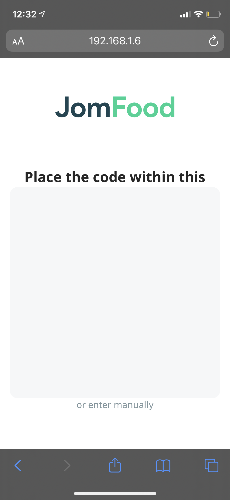
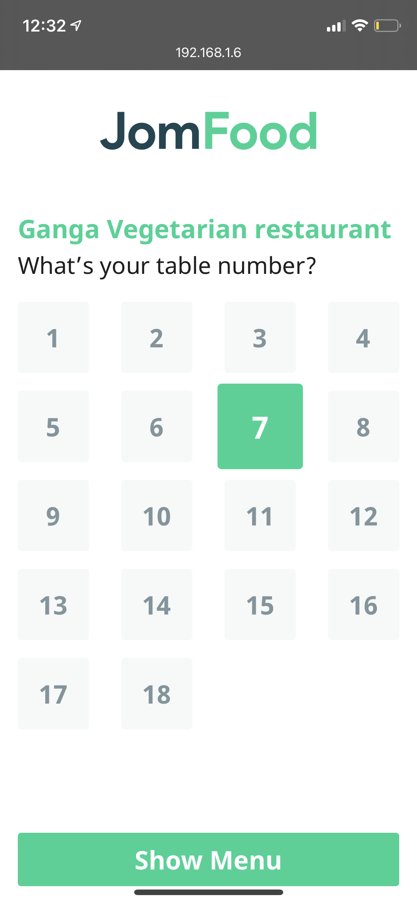
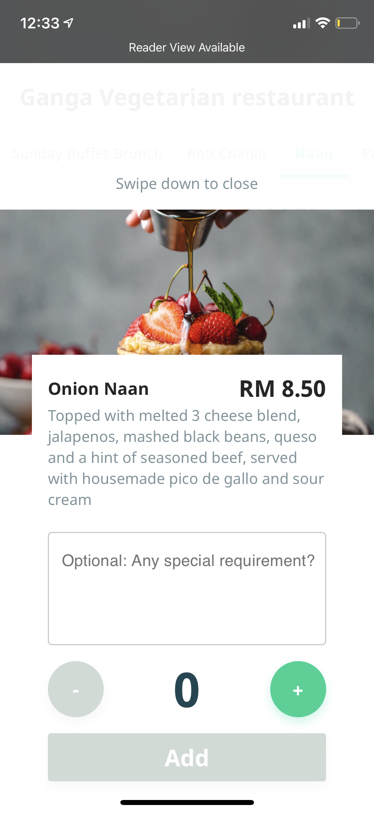
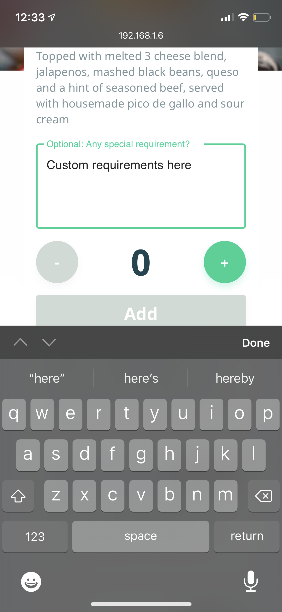
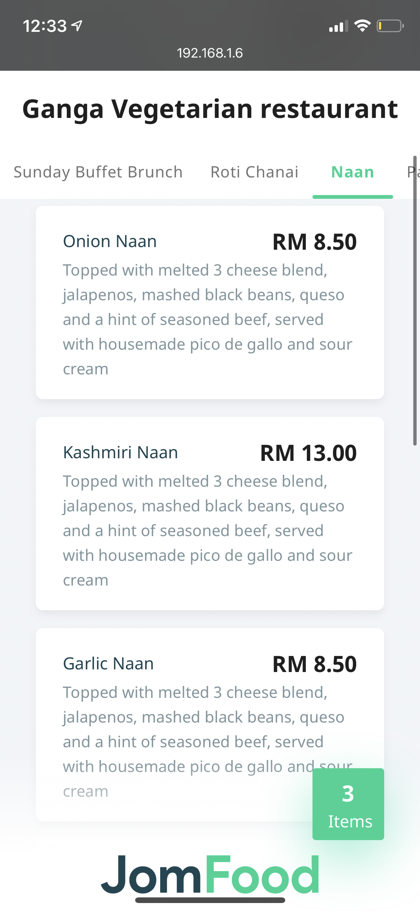
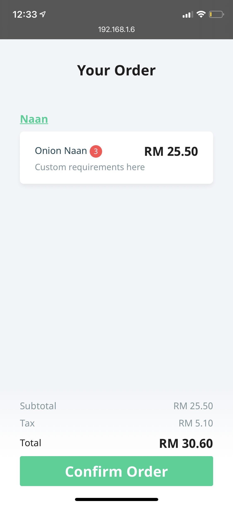

# Why was this project created?

This project was one of the startups that I started in Malaysia but lost motivation and interest on this project so I decided to open source this code. Have fun. I manage to write this code in a week time than got busy with work and never looked back.

# How does this app function?

## Scan QR Code

## Select your table

## See Menu

## Select Item to Add

## Enter item info

## Enter Quantity

## Click on Image to enhance it

## Once Items are added, you can see total items

## Checkout menu

