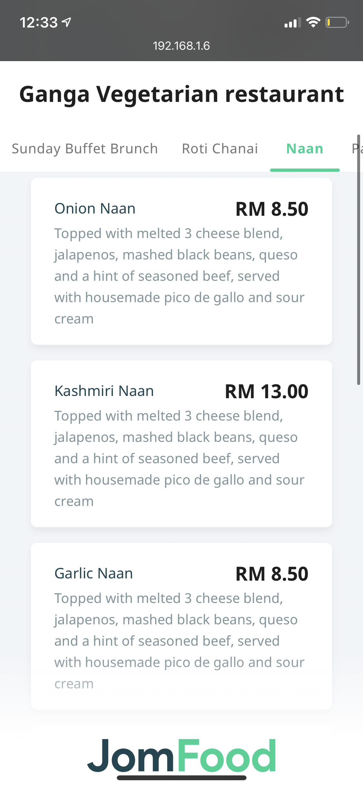
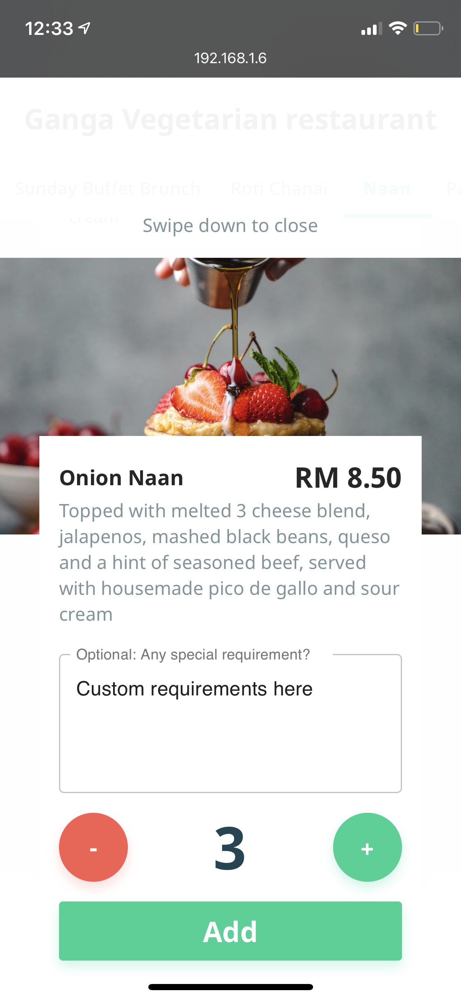

# How does this app function?

## Scan QR Code

## Select your table

## See Menu

## Select Item to Add

## Enter item info

## Enter Quantity

## Click on Image to enhance it

## Once Items are added, you can see total items

## Checkout menu

